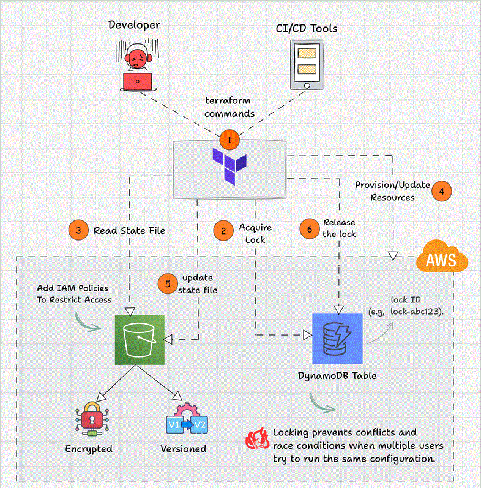

# Secure Terraform State Management on AWS

This repository documents a production-style Terraform state management workflow implemented on AWS using S3 and DynamoDB.

The project focuses on secure remote state storage, state locking, safe state refactoring, and recovery from state lock scenarios commonly encountered in real-world Terraform operations.

## What This Project Covers
- Remote Terraform backend configuration using S3 with encryption
- State locking using DynamoDB
- Migration from local to remote Terraform state
- Terraform state inspection and auditing
- Safe state modification without infrastructure changes
- Importing existing AWS resources into Terraform state
- State refactoring and lock recovery

## Documentation
- 📄 Full project documentation:  
  `docs/Secure Terraform State Management on AWS using S3 and DynamoDB.pdf`

## Tools Used
- Terraform
- AWS (S3, DynamoDB, EC2)
- AWS CLI

## Notes
This project focuses on Terraform state operations and does not provision a full application stack.
